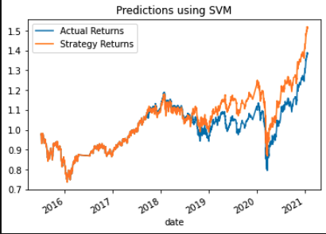
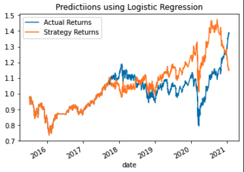

# Algorithmic Trading Bot

This trading bot implements an algortithmic tradiing strategy that uses machine learning to automate trade decisions. The trading signals are programmed to adapt to new data and evolving markets. 

----

## Technologies
This application is written in Jupyter Lab Notebook in the Python programming language.The Python libraries, tools, and modules used in this application are Pandas, NumPy, pathlib, hvplot, matplotlib, scikit-learn (SVM, StandardScaler, classification_report, LogisticRegression)

[Pandas](https://pandas.pydata.org/docs/index.html), [NumPy](https://numpy.org/doc/), [pathlib](https://docs.python.org/3/library/pathlib.html), [hvplot](https://hvplot.holoviz.org/), [matplotlib](https://matplotlib.org/stable/index.html), [scikit-learn](https://scikit-learn.org/stable/index.html) 

----

## Installation Guide
This program uses the Pandas library. If the user is not already running an environment that includes Pandas, then they will need to intall the library. Instructions shown in the installation guide --> [Pandas Installation Guide](https://pandas.pydata.org/docs/getting_started/install.html)

For the program to run correctly, the user must make sure that all libraries and modules are correctly imported in the beginning of the code. This looks like:

    import pandas as pd
    from pathlib import Path
    import numpy as np
    import hvplot.pandas
    import matplotlib.pyplot as plt
    from sklearn import svm
    from sklearn.preprocessing import StandardScaler
    from pandas.tseries.offsetsd import DateOffset
    from sklearn.metrics import classification_report

----

## Usage

**The program is comprised of 4 parts:**

1. Establish a Baseline Performance

In this section, the code will run to establish a baseline performance for the trading algorithm. It uses short and long window SMA values as trading signals. It uses the SVC classifier model from SKLearn's support vector machine (SVM) learning method to fit the training data and make predictions based on the testing data. The program then plots the actual returns vs the strategy returns (shown below).

This plot shows the results of the predicted strategy returns vs the actual returns. The plot shows that when the predicted strategy returns match the start of the actual returns, it learns from the model and begins to show higher returns vs the actual as time goes on. From late 2018 to 2021, the SVM model slightly outperforms the actual, showing an overall higher cumulative return. 

2. Tune the Baseline Trading Algorithm

In this section, the program will adjust the model's input features to find the best trading outcomes. It will first adjust the size of the training dataset by slicing the data into different periods. By increasing the dataset to 12 months, the prediction accuracy of the model improved. Secondly, it will adjust the window periods, but saw underperformance so will stay at original.

3. Evaluate a New Machine Learning Classifier

This section will apply the original parameters to a second machine learning model, using Logistic Regression. The program will backtest the model to evaluate its performance, shown as a plot in the visualization below.

This plot shows the new predicted strategy returns found from Logistic Regression vs the origianl actual returns. We can see that the Logistic Regression model greatly outperforms what we saw earlier in the SVM model. However, towards the end of 2021 the LR model begins to tank to meet the actual returns.

4. Create an Evaluation Report

In this program we are evaluating 2 different machine learning models to find the best trading strategy. First, we used the SVM model, which showed us better cumulative returns, but really didnt prove to be noticably profitable vs trading at the actual returns. Second, we used the Logistic Regression model. This model proved to greatly outperform the SVM model, showing almost double the cumulative returns and offering a better trading. However, it is extremely more volatile. The best trading strategy would be up to the risk profile of the trader. The SVM model proves small profits and less risk and the Logistic Regression model proves larger profits but high volatiility and more risk.

----

## Contributors

Arlie Jones

[E-mail](arliejones98@gmail.com)  |  [LinkedIn](https://www.linkedin.com/in/arlie-jones-020092159/)

----

## License

None